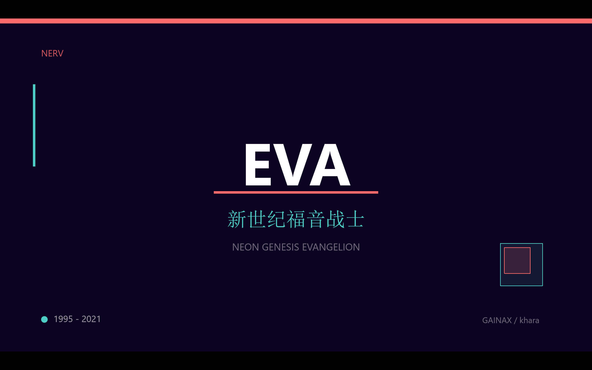
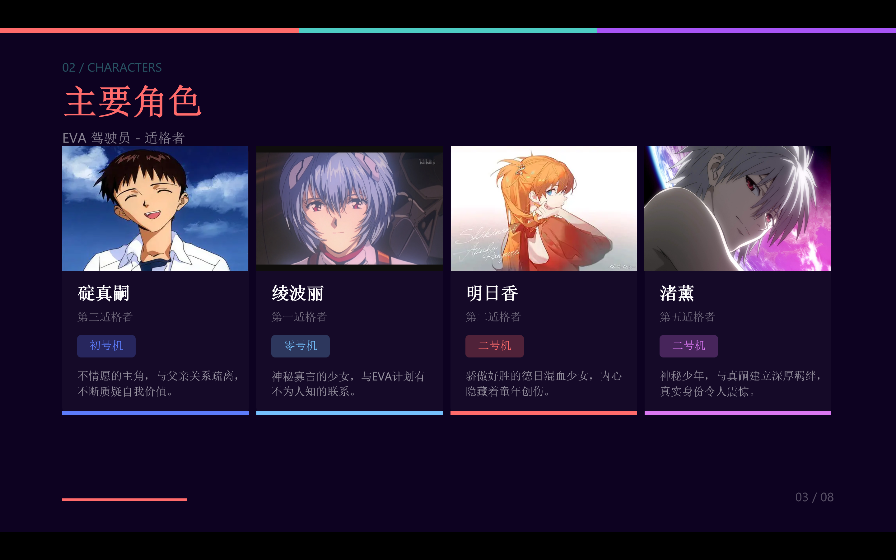
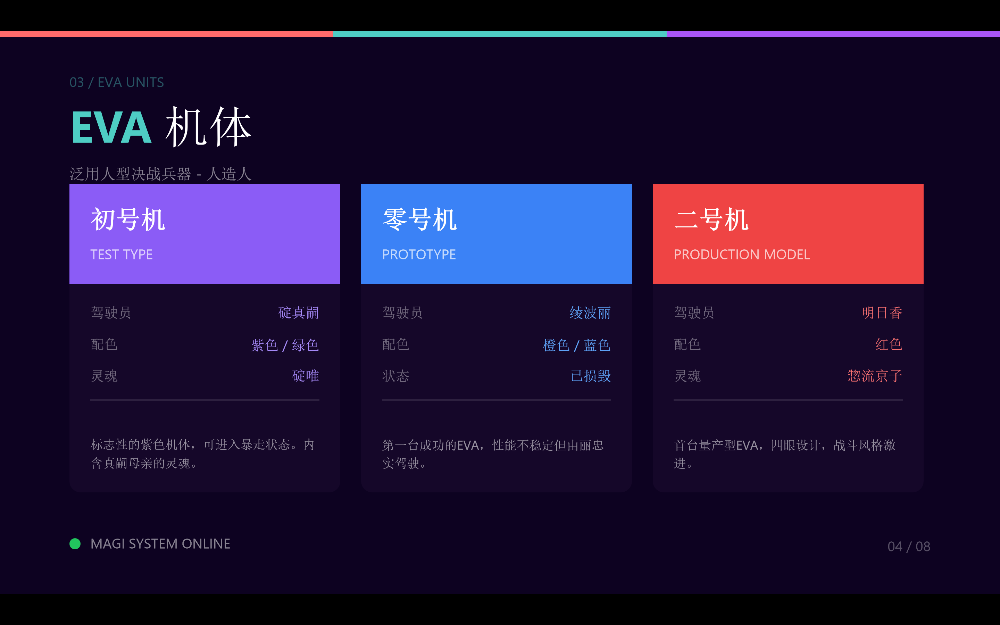
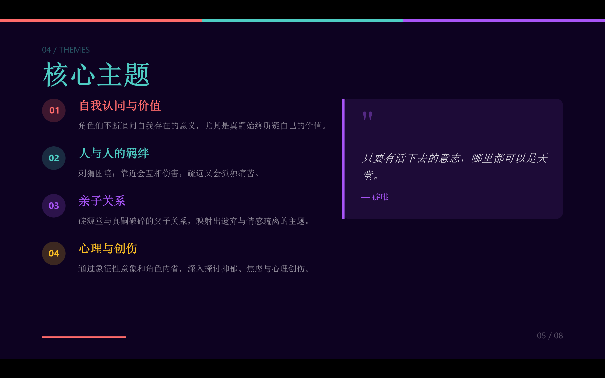
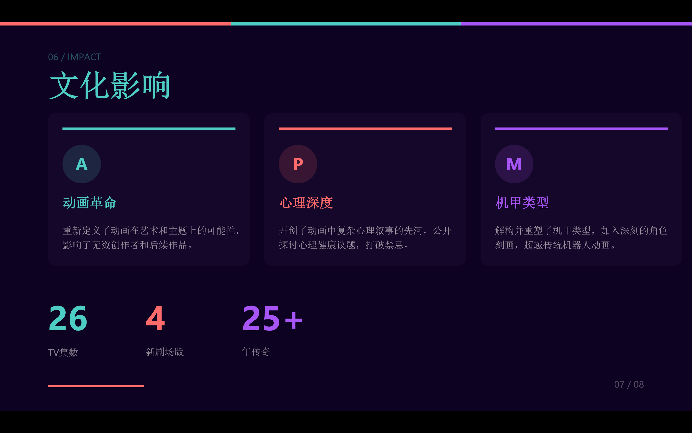
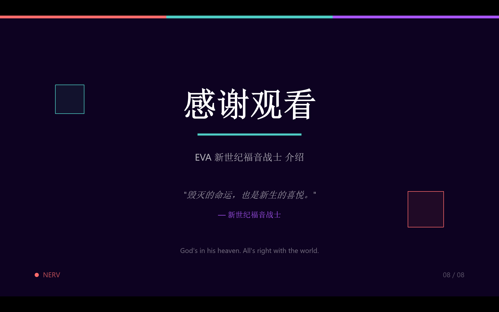

# 使用 Claude Code 的 pptx-skills 技能生成精美 EVA 主题 PPT 完整指南

## 前言

本文详细记录了使用 Claude Code 的 `pptx-skills` 技能，从零开始生成一套精美的《新世纪福音战士》(EVA) 主题 PowerPoint 演示文稿的完整过程。经过 4 个版本的迭代优化，最终产出了一套具有专业设计水准的 8 页 PPT。

## 目录

1. [技术栈介绍](#技术栈介绍)
2. [项目初始化](#项目初始化)
3. [V1 版本：英文原型](#v1-版本英文原型)
4. [V2 版本：中文化与图片集成](#v2-版本中文化与图片集成)
5. [V3 版本：布局修复与美化](#v3-版本布局修复与美化)
6. [V4 版本：专业级设计重构](#v4-版本专业级设计重构)
7. [遇到的问题与解决方案](#遇到的问题与解决方案)
8. [最终成果展示](#最终成果展示)
9. [总结与心得](#总结与心得)

---

## 技术栈介绍

### pptx-skills 工作流程

`pptx-skills` 是 Claude Code 的一个内置技能，采用 **html2pptx** 工作流：

```
HTML/CSS 设计 → Playwright 渲染 → 元素位置提取 → PptxGenJS 生成 PPTX
```

**核心组件：**

| 组件 | 作用 |
|------|------|
| **HTML/CSS** | 设计幻灯片布局和样式 |
| **Playwright** | 无头浏览器，渲染 HTML 并提取元素位置 |
| **PptxGenJS** | Node.js 库，生成 .pptx 文件 |
| **Sharp** | 图像处理库（可选） |

**关键约束：**
- 幻灯片尺寸：720pt × 405pt（16:9 比例）
- 安全边距：距离边缘至少 0.5 英寸（36pt）
- 不支持 CSS 渐变（需用纯色或预渲染图片替代）
- 文本元素（`<p>`, `<h1>` 等）不支持 border 属性

---

## 项目初始化

### 1. 创建项目目录

```bash
mkdir ppt-test
cd ppt-test
```

### 2. 初始化 Node.js 项目

```bash
npm init -y
npm install pptxgenjs playwright sharp
```

### 3. 安装 Playwright 浏览器

```bash
npx playwright install chromium
```

**遇到的问题：** 首次运行时报错 "Executable doesn't exist"，原因是 Playwright 需要单独下载浏览器二进制文件。

---

## V1 版本：英文原型

### 设计目标

创建一套基础的 EVA 主题 PPT，包含 8 张幻灯片：

1. 标题页 (Title)
2. 故事概述 (Story)
3. 主要角色 (Characters)
4. EVA 机体 (EVA Units)
5. 核心主题 (Themes)
6. 系列年表 (Timeline)
7. 文化影响 (Impact)
8. 感谢页 (Thanks)

### HTML 模板结构

每个幻灯片都是一个独立的 HTML 文件，基本结构如下：

```html
<!DOCTYPE html>
<html>
<head>
<style>
html { background: #ffffff; }
body {
  width: 720pt;
  height: 405pt;
  margin: 0;
  padding: 0;
  background: #1a0a2e;
  font-family: Arial, sans-serif;
}
/* 具体样式... */
</style>
</head>
<body>
  <!-- 内容元素 -->
</body>
</html>
```

### 生成脚本 (create-ppt.js)

```javascript
const pptxgen = require('pptxgenjs');
const html2pptx = require('path/to/html2pptx.js');
const path = require('path');

async function createPresentation() {
    const pptx = new pptxgen();
    pptx.layout = 'LAYOUT_16x9';

    const slides = [
        'slide1-title.html',
        'slide2-story.html',
        // ...
    ];

    for (const slideFile of slides) {
        await html2pptx(path.join(__dirname, slideFile), pptx);
    }

    await pptx.writeFile({ fileName: 'output.pptx' });
}

createPresentation();
```

### V1 成果

- 成功生成 8 页英文 PPT
- 采用深紫色 + 青色 + 红色的 NERV 配色方案
- 基础布局完成

---

## V2 版本：中文化与图片集成

### 改进内容

1. **全部内容翻译为中文**
2. **修复角色页文字溢出问题**
3. **尝试集成角色图片**

### 图片集成的挑战

最初尝试在 HTML 中直接使用 `` 标签或 `background-image`，但遇到了问题：

```html
<!-- 这种方式在 Windows 上有路径编码问题 -->

```

**解决方案：混合模式**

采用"HTML 布局 + API 插入图片"的混合方案：

1. HTML 中使用占位符 `<div class="char-img-placeholder">`
2. 生成脚本中使用 PptxGenJS API 插入图片

```javascript
// 在角色页面添加图片
if (characterSlide) {
    const images = [
        { file: 'shinji.png', x: 0.83, y: 1.32, w: 1.71, h: 1.14 },
        // ...
    ];

    for (const img of images) {
        characterSlide.addImage({
            path: path.join(imagesDir, img.file),
            x: img.x, y: img.y, w: img.w, h: img.h
        });
    }
}
```

### 坐标计算

图片位置需要精确计算，转换公式：

```
英寸 = 点数 / 72
```

例如，卡片位于 `left: 50pt, top: 85pt`，内边距 `10pt`：
- 图片 X = (50 + 10) / 72 = 0.83 英寸
- 图片 Y = (85 + 10) / 72 = 1.32 英寸

---

## V3 版本：布局修复与美化

### 用户反馈

用户提供了 V2 版本的截图，指出以下问题：
- 角色图片位置与卡片不对齐
- 部分页面文字溢出
- 整体设计不够精致

### 改进措施

1. **重新计算图片坐标**
2. **调整卡片尺寸和间距**
3. **优化配色方案**

### 验证错误处理

html2pptx 工具有严格的验证机制：

```
Error: Text box ... ends too close to bottom edge
```

**解决方法：** 减小 padding、调整 font-size、确保内容在安全区域内。

---

## V4 版本：专业级设计重构

### 设计分析

作为"资深设计师"对 V3 进行分析：

**问题诊断：**
1. 标题页和结束页的双色分割背景过于生硬
2. 大面积纯色块显得廉价
3. 排版密度不均
4. 装饰元素单调
5. 字体层级不清晰

### 全新设计方案

**配色系统：**
```css
--bg-primary: #0d0221;      /* 深紫色背景 */
--accent-red: #ff6b6b;      /* NERV 红 */
--accent-cyan: #4ecdc4;     /* 青色 */
--accent-purple: #a855f7;   /* 紫色 */
```

**统一的顶部彩条：**
```css
.top-bar { background: #ff6b6b; width: 240pt; }
.top-bar2 { background: #4ecdc4; width: 240pt; left: 240pt; }
.top-bar3 { background: #a855f7; width: 240pt; left: 480pt; }
```

**章节编号系统：**
```html
<p class="section-num">01 / STORY</p>
<h1>故事概述</h1>
```

### CSS 渐变的替代方案

html2pptx 不支持 CSS 渐变，需要用纯色替代：

```css
/* 不支持 */
background: linear-gradient(135deg, #0d0221, #1a0a2e);

/* 替代方案：使用纯色 */
background: #0d0221;
```

### 边框属性限制

文本元素不能有 border：

```css
/* 不支持 - 会报错 */
.eva-desc {
  border-top: 1pt solid rgba(255,255,255,0.1);
}

/* 替代方案：使用单独的 div */
.desc-divider {
  width: 100%;
  height: 1pt;
  background: rgba(255,255,255,0.1);
}
```

### 布局溢出修复

多次遇到水平溢出错误：

```
Error: HTML content overflows body by 29.3pt horizontally
```

**计算公式：**
```
总宽度 = 左边距 + (卡片宽度 × 数量) + (间距 × (数量-1)) + 右边距
```

例如 3 张卡片：
```
50 + (190 × 3) + (20 × 2) + 50 = 710pt ✓ (< 720pt)
50 + (195 × 3) + (20 × 2) + 50 = 725pt ✗ (溢出)
```

---

## 遇到的问题与解决方案

### 问题汇总表

| 问题 | 原因 | 解决方案 |
|------|------|----------|
| 依赖找不到 | node_modules 不在当前目录 | `npm install` 安装依赖 |
| Playwright 浏览器缺失 | 需要单独下载 | `npx playwright install chromium` |
| 中文文件名读取失败 | Windows 路径编码问题 | 重命名为英文文件名 |
| CSS 渐变不支持 | html2pptx 限制 | 使用纯色背景 |
| 文本元素 border 报错 | html2pptx 限制 | 使用单独的 div 元素 |
| 内容溢出 | 尺寸计算错误 | 精确计算并预留边距 |
| 图片位置不准 | 坐标计算错误 | 使用 pt → inch 转换公式 |

### 调试技巧

1. **逐页测试**：先单独测试每页，确认无误后再批量生成
2. **控制台日志**：在脚本中添加详细日志
3. **浏览器预览**：直接在浏览器中打开 HTML 文件预览效果

---

## 最终成果展示


### v4版ppt


















### 文件结构

```
ppt-test/
├── images/
│   ├── shinji.png
│   ├── rei.png
│   ├── asuka.png
│   └── kaworu.png
├── slide1-title-v4.html
├── slide2-story-v4.html
├── slide3-characters-v4.html
├── slide4-eva-units-v4.html
├── slide5-themes-v4.html
├── slide6-timeline-v4.html
├── slide7-impact-v4.html
├── slide8-thanks-v4.html
├── create-ppt-v4.js
├── package.json
└── EVA-Introduction-CN-v4.pptx  ← 最终输出
```

### 各页面设计亮点

| 页面 | 设计特点 |
|------|----------|
| 标题页 | 居中大标题 + NERV 标识 + 装饰方块 |
| 故事概述 | 主内容卡片 + 三列信息卡片 |
| 主要角色 | 四列角色卡片 + 底部彩色线条 |
| EVA 机体 | 紫/蓝/红三色头部卡片 |
| 核心主题 | 左侧编号列表 + 右侧引用卡片 |
| 系列年表 | 圆形时间节点 + 终章卡片 |
| 文化影响 | 三列影响力卡片 + 统计数据 |
| 感谢页 | 居中标题 + 引用 + NERV 标语 |

---

## 总结与心得

### 技术收获

1. **html2pptx 工作流**：理解了 HTML → PPTX 的转换原理
2. **精确布局计算**：掌握了 pt/inch 转换和边距计算
3. **混合模式图片插入**：学会了 HTML 占位 + API 插入的技巧
4. **CSS 限制应对**：了解了工具的限制并找到替代方案

### 设计心得

1. **迭代优化**：从 V1 到 V4，每次迭代都有明显提升
2. **统一视觉语言**：三色顶栏 + 章节编号 + 页码系统
3. **信息层级**：通过颜色、大小、位置区分信息重要性
4. **呼吸感**：适当留白，避免内容过于拥挤

### 适用场景

`pptx-skills` 适合：
- 需要批量生成 PPT 的场景
- 有明确设计规范的项目
- 程序化生成报告/文档

不太适合：
- 需要复杂动画效果
- 需要大量渐变/阴影效果
- 一次性简单 PPT（直接用 PowerPoint 更快）

### 完整代码仓库

本项目的完整代码和生成的 PPT 文件位于：
```
A:\study\AI\LLM\Claude-Skills-Test\ppt-test\
```

---

## 附录：V4 版本完整生成脚本

```javascript
const pptxgen = require('pptxgenjs');
const html2pptx = require('C:/Users/XX/.claude/skills/pptx-skills/scripts/html2pptx.js');
const path = require('path');

async function createEVAPresentation() {
    const pptx = new pptxgen();
    pptx.layout = 'LAYOUT_16x9';
    pptx.title = '新世纪福音战士 - 介绍';
    pptx.author = 'Claude Code';

    const slidesDir = path.join(__dirname);
    const imagesDir = path.join(slidesDir, 'images');

    const slides = [
        'slide1-title-v4.html',
        'slide2-story-v4.html',
        'slide3-characters-v4.html',
        'slide4-eva-units-v4.html',
        'slide5-themes-v4.html',
        'slide6-timeline-v4.html',
        'slide7-impact-v4.html',
        'slide8-thanks-v4.html'
    ];

    // 角色图片配置
    const characterImages = [
        { file: 'shinji.png', x: 0.69, y: 1.32, w: 2.08, h: 1.39 },
        { file: 'rei.png', x: 2.86, y: 1.32, w: 2.08, h: 1.39 },
        { file: 'asuka.png', x: 5.03, y: 1.32, w: 2.08, h: 1.39 },
        { file: 'kaworu.png', x: 7.19, y: 1.32, w: 2.08, h: 1.39 }
    ];

    let characterSlide = null;

    for (let i = 0; i < slides.length; i++) {
        const result = await html2pptx(
            path.join(slidesDir, slides[i]),
            pptx
        );

        if (slides[i] === 'slide3-characters-v4.html') {
            characterSlide = result.slide;
        }
    }

    // 插入角色图片
    if (characterSlide) {
        for (const img of characterImages) {
            characterSlide.addImage({
                path: path.join(imagesDir, img.file),
                x: img.x, y: img.y, w: img.w, h: img.h
            });
        }
    }

    await pptx.writeFile({
        fileName: path.join(slidesDir, 'EVA-Introduction-CN-v4.pptx')
    });
}

createEVAPresentation();
```

---

*本文由 Claude Code 协助完成，记录于 2026 年 1 月 11 日*
